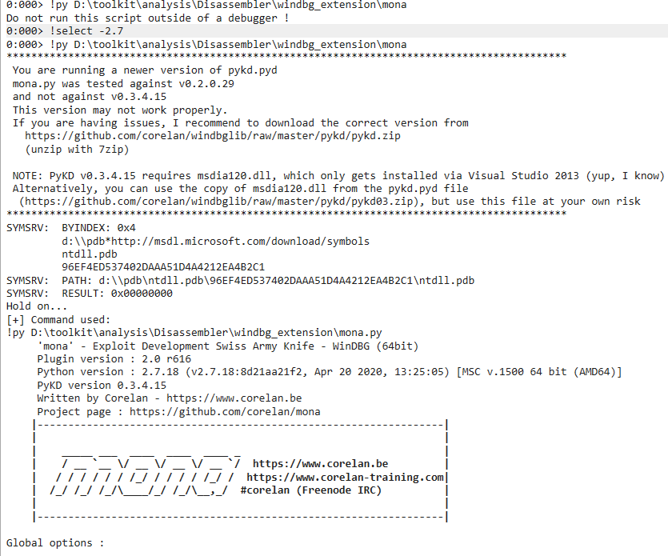
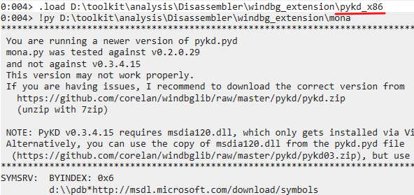

## 0x0 Environment

`Win10 21h2`

run `Windbg Preview` as an administrator

## 0x1 Mona2

### 0x11 Installation in Windbg Preview

Reference： https://whatdocumentary.tistory.com/67

Save this WebPage as a PDF in Folder

1. install Python2.7 (x64 and x86).

   (if you analysis x86 file,u have to use python_x86, and so are the x64 edition )

2. install pykd modulde by pip.

   check python version.Then install pykd.

   `py --list`.

   

   ```python
   py -2.7-64 -m pip install --upgrade pykd
   py -2.7-32 -m pip install --upgrade pykd
   ```

3. Download mona、windbglib、pykd.dll.

   1. mona.py https://github.com/corelan/mona

   2. windbglib  https://github.com/corelan/windbglib

   3. pykd.dll(x64_edition And x86_edition,It is better to change the name to distinguish) https://githomelab.ru/pykd/pykd-ext/-/wikis/Downloads

      `gsudo regsvr32.exe .\msdia120.dll`,Register msdia120.dll through the regsvr32.exe. u have to do it in cmd with administrator privileges.

4. Use Mona.py

   When Windbg launch x64 File。

   1. `.extpath+ D:\dbgext`

   ```
   0: kd> .extpath  D:\dbgext
   Extension search path is: D:\dbgext
   ```

   2. `.load pykd_x64`
   3. `!select -2.7` change python editon.
   4. `!py D:\dbgext\mona`
   5. `!py D:\dbgext\mona update`

5. attach the x32 file,`pykd_x86.dll` loads well.

   

   Python runs in 32-bit.

6. comment out these print.

Or Run the Initiation script，use`$$>a<d:\dbgext\InitMona.txt x86` command.

### 0x12 Configurationw

#### 0x121 Set Working directory

dump data to files created in the mona's working directory.

We can specify a working directory which depends on the process name and id by using the format specifiers `%p (process name)` and `%i	(process id)`.

`!py d:\dbgext\mona config -set workingfolder "d:\temp\mona_files\%p_%i"`

#### 0x123 Exclude module

exclude specific modules

```python
!py d:\dbgext\mona  config -set excluded_modules "module1.dll,module2.dll"
!py d:\dbgext\mona  config -add excluded_modules "module3.dll,module4.dll"
```

#### 0x124 Set the author

`!py d:\dbgext\mona config -set author aWei`

### 0x13 Mona Manual

[kanxue(Chinese Edition)](http://bbs.pediy.com/showthread.php?t=199198&highlight=mona)

[offical](https://www.corelan.be/index.php/2011/07/14/mona-py-the-manual/)

### 0x14 Example

`!py d:\dbgext\mona  findwild -s "push r32 # * # pop eax # inc eax # * # retn"`

| Command        | Description                                                  |
| -------------- | ------------------------------------------------------------ |
| findwild       | find chains of instructions with a particular form           |
| -s             | specifies the shape of the chain                             |
| '#'            | instructions are separated with '#'                          |
| r32            | is any 32-bit register                                       |
| *              | is any sequenece of instructions                             |
| -depth \<nr\>  | maximun length of the chain                                  |
| -b \<address\> | base address for the search                                  |
| -t \<address\> | top address for the search                                   |
| -all           | returns also chains which contain "bad" instruction that might break the chian(jumps,calls,..) |

### 0x15 ROP Chains

Mona can find  `ROP gadgets` and build `ROP chains`.

